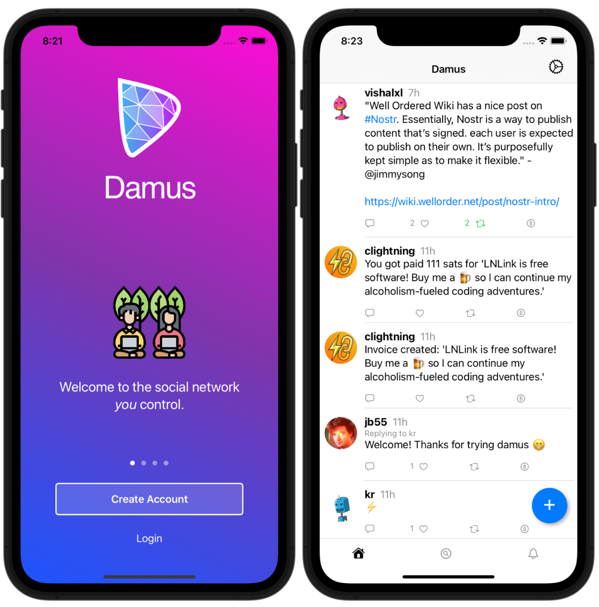

# damus

A twitter-like [nostr][nostr] client for iPhone, iPad and MacOS.

[nostr]: https://github.com/fiatjaf/nostr

## Spec Compliance

damus implements the following [Nostr Implementation Possibilities][nips]

- [NIP-01: Basic protocol flow][nip01]
- [NIP-08: Mentions][nip08]
- [NIP-10: Reply conventions][nip10]
- [NIP-12: Generic tag queries (hashtags)][nip12]

[nips]: https://github.com/nostr-protocol/nips
[nip01]: https://github.com/nostr-protocol/nips/blob/master/01.md
[nip08]: https://github.com/nostr-protocol/nips/blob/master/08.md
[nip10]: https://github.com/nostr-protocol/nips/blob/master/10.md
[nip12]: https://github.com/nostr-protocol/nips/blob/master/12.md

## Contributing

Contributors welcome! [Email patches][git-send-email] to jb55@jb55.com are preferred, but I accept PRs on github as well.

[git-send-email]: http://git-send-email.io

